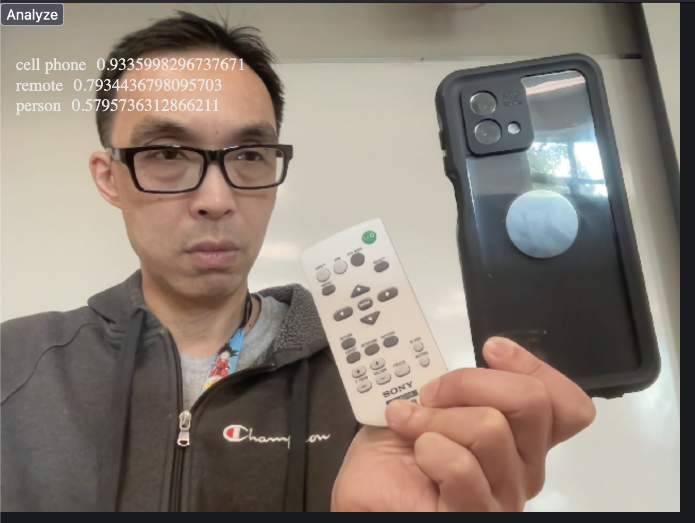

# ai-tensorflow-js

If you follow https://github.com/env3d/oauth-vision-api-tutorial, you will have a basic understading
of how you can integrate AI into your app via cloud API.  However, what you will also noticed is that
these services are often costly, and requires in functional internet connection.

## Local Models

For some basic ML tasks, it is preferrable to download a local model so eliminate the need for
an internet connection as well as cost, at the expense of using more of the device's power
and RAM.

Tensorflow has a library called https://www.tensorflow.org/js, which contains information
on local models you can download and use within your web application.

Modify the index.html file from https://github.com/env3d/oauth-vision-api-tutorial to use 
the "Object Detection" model.  Your output should be very similar to the original version,
with a lower accuracy.

To get this working, you'll have to pay attention to how the model is loaded (and take care
of asycn loading if required) and the return format of the model, as the format
is different from the cloud version.

